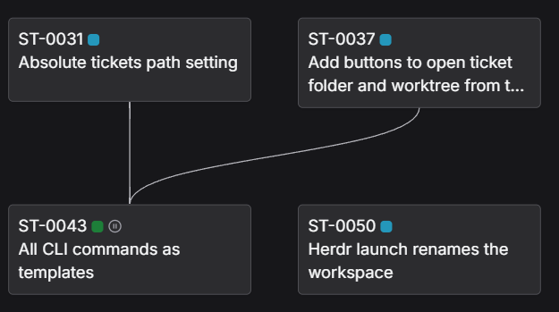
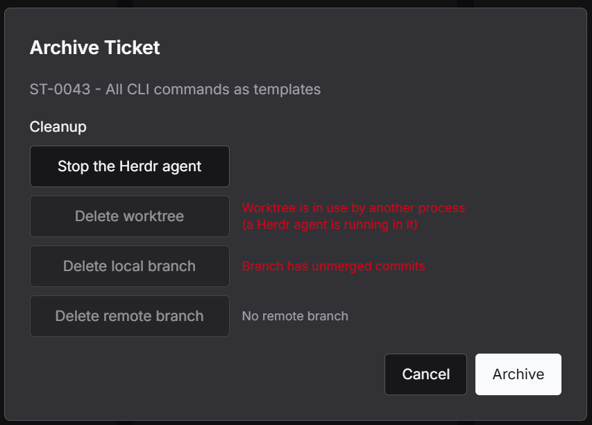
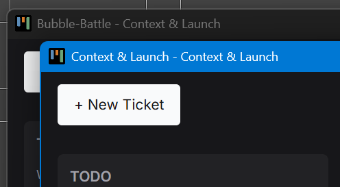
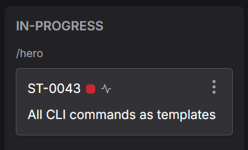

# Changelog

## June 19–July 19, 2026

### Highlights

- Added Forest View, a pannable and zoomable dependency map with persistent ticket positions, dependency editing, grouping, nested sub-forests, selection, and automatic layout.

- Added Herdr integration, including agent launching, persistent ticket panes, agent restarts, live status indicators, and agent shutdown during ticket cleanup.

- Added multi-window support so projects can open in separate Electron windows and active project windows can be restored between sessions.

- Added ticket status color swatches and Herdr agent status icons to Kanban and Forest cards.

### More

- Added an application log viewer with resizable and draggable UI, rolling log files, and a clear-all action.
- Added a button for regenerating the next available ticket number from the entered prefix.
- Added configurable branch prefixes for agent worktrees in project settings.
- Added warnings when launch commands use `.cmd` or `.bat` files, which cannot safely receive multiline prompts.
- Added persistence of a hand-edited launch prompt into the column's launch preferences, so it is restored when the ticket is reopened.

### Changed

- Reworked ticket archive and delete flows into a unified cleanup dialog that checks available actions, stops matching Herdr agents, and runs selected cleanup actions independently.
- Changed behind-remote detection from a blocking error to a warning with Proceed and Cancel actions.
- Initial prompts are now passed directly as agent arguments, improving launch reliability and removing temporary prompt-file handling.
