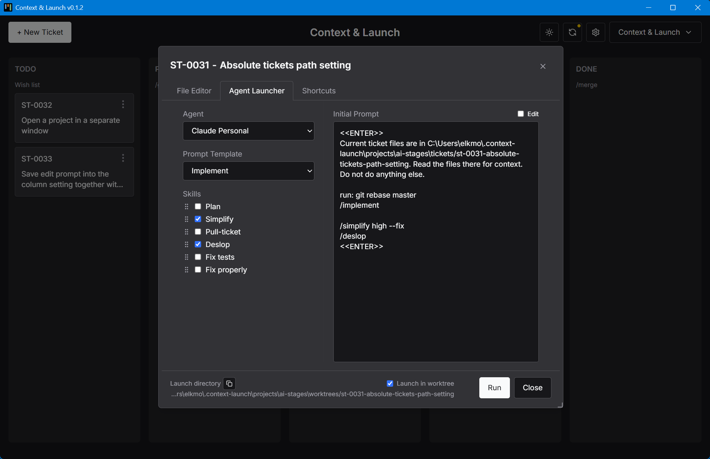
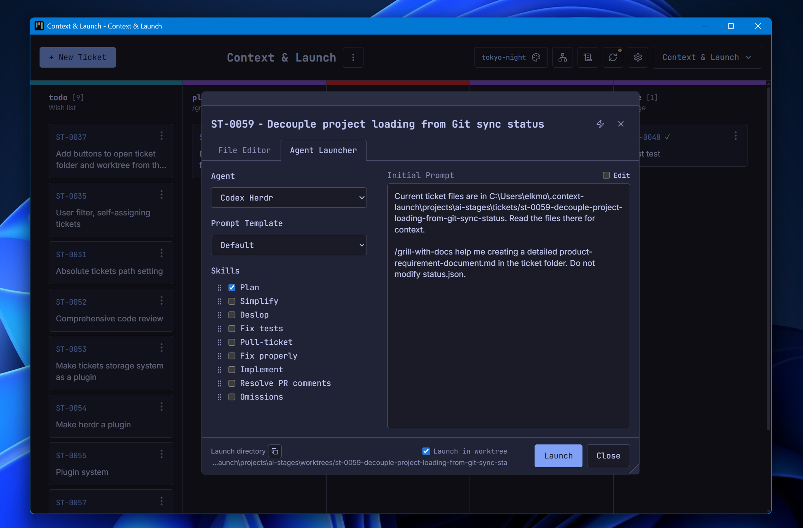

# Context & Launch

A local kanban board with context engineering, automatic worktrees, and git ticket storage. Assemble a prompt and launch an AI agent in one click.

See the [CHANGELOG](CHANGELOG.md) for recent updates.

- [Overview](#overview)
- [Why it exists](#why-it-exists)
- [Key features](#key-features)
- [Example workflow](#example-workflow)
- [Ticket storage](#ticket-storage)
- [Integration with AI agents](#integration-with-ai-agents)
  - [Run as a normal desktop app](#run-as-a-normal-desktop-app)
  - [First-time setup](#first-time-setup)
  - [For contributors](#for-contributors)

## Overview

There is no fixed workflow, no rules, and no standard.
Think of this app as a highly configurable todo+notepad with CLI shortcuts that is especially suited for AI-assisted workflow.
It has a convenient kanban board for all notes, so the developer won't forget where each task is, and can easily pick up from where they left off.





## Why it exists

Slop-code orchestrators are not capable of creating production code yet, but we still need to automate our chores when adding AI agents to the workflow.

AI-assisted workflow is too fast and too complicated, with context switching all the time.
It requires the developer to constantly wait for the agent's slow operations and enter the same prompts and git commands over and over.
It is easy to forget to enter a prompt, make a mistake on the command line, skip creating a worktree, or fall asleep while waiting.

**Context & Launch** allows the developer to batch as many operations as possible into a single run and leave the agent for hours while it works in the background.
Meanwhile, the developer can start planning the next ticket, review the work of the previous agent, go to a meeting, or take a break.

## Key features

- Kanban board with customizable columns
- Each ticket is a folder with markdown, images, and other files
- Integrated markdown editor for files in the ticket folder
- Git-native ticket storage (on an orphan branch), can sync with your team
- Automatic creation of worktrees (isolated branches for AI to work in)
- Prompt templates and skill templates for customizable prompt assembly
- Agent launcher that assembles and runs the prompt
- That's all!

## Example workflow

This is an example workflow for a solo personal project (no teamwork for simplicity).

Small changes that an LLM will most likely one-shot in under 3 minutes can go directly on master -- no need for the full pipeline. For bigger changes that need planning, the workflow below applies.

The workflow is reflected in columns. Each column represents a separate step.

**TODO** -- Drop ideas in this column. Sometimes just the ticket name is enough; sometimes open the ticket and use the markdown editor to edit `to-do.md` with a short explanation of what has to be done.

**PLAN** -- Launch the agent with Matt Pocock's `/grill-me` skill. It goes over all questions the agent might have BEFORE starting the implementation, which significantly improves the resulting code quality. At the end, it produces a `product-requirement-document.md` with all decisions made, ready for the implementation step.

**IMPLEMENTATION** -- The main work step. Use a custom skill to run planning, execution, self-review, `/simplify`, omission check, `/exploratory-testing` and other steps to correct the implementation. Practice shows that LLMs are unable to comply with all rules, but they can correct after the implementation.

**REVIEW** -- The second interactive phase: read the generated code, ask questions to the LLM, and request changes.

**MERGE** -- The `/merge` skill squashes all commits, rebases, and fast-forwards master on the resulting commit. After that, select "Archive" in the ticket menu to hide the ticket and delete the worktree and the temporary branch.

## Ticket storage

Tickets are stored as folders on a git orphan branch -- a branch with no common history with the project code. This keeps ticket data out of the code history entirely.

The orphan branch lives in a separate git worktree under `~/.context-launch/projects/{projectSlug}/tickets/`. Each ticket is a folder containing a `status.json` and any number of files: markdown context documents, images, PDFs, or anything else relevant to the task.

Because it is a regular git branch, ticket data can be synced with teammates via push/pull. The Sync button on the board toolbar commits local changes, rebases on the remote, and pushes -- all in one click. If the rebase hits a conflict, the app offers to launch Claude to resolve it automatically.

## Integration with AI agents

Default settings include support for [Claude Code](https://code.claude.com/docs/en/overview). [Pi](https://pi.dev/) was tested and it worked fine.

The Windows script requires [Windows Terminal](https://learn.microsoft.com/en-us/windows/terminal/install), but if a different terminal is preferred, just ask Claude to modify the script.

**Context & Launch** does NOT provide additional UI on top of existing agents, and this is intentional:
- Anthropic will bill third-party interfaces separately from subscriptions starting 15 June 2026
- The problem of agentic UI is already solved

### Run as a normal desktop app

```
npm run electron:dist
```

On Windows this produces `dist-electron/context-launch-setup.exe` (NSIS installer).
It requires (not mandatory, but default settings expect): [Windows Terminal](https://learn.microsoft.com/en-us/windows/terminal/install).

On macOS this produces `dist-electron/context-launch-setup.dmg`. Open the DMG and drag the app to Applications.
The build is unsigned. On first launch, right-click the app and choose Open (or go to System Settings > Privacy & Security > Open Anyway).

### First-time setup

After adding a project to the app, go to Settings and configure it for the desired workflow.

The app comes with a starting set of prompts, skills, and launch commands, but they almost certainly won't match any particular workflow -- every developer uses different skills, commands, editors, and optional tooling (Jira, etc.). Treat the built-ins as examples to edit or replace, not as a config to leave untouched.

Click the gear icon in the top-right header to open Settings, then walk through the tabs.
Most items can be saved at User scope (shared across all projects) or Project scope (only the current project).
Most templates accept placeholders like `{{ticketDir}}`, `{{ticketTitle}}`, `{{projectPath}}` that are filled in at launch time.

Tickets can be added to the board right away, but expect to spend a few minutes tailoring prompts, skills, and launch commands before the one-click launch fits the workflow.

### For contributors

```
npm install
npm run dev
```

If you wish to contribute, please create an issue first. PRs from unknown contributors will be ignored.
